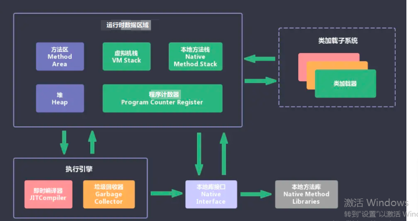

<meta name="referrer" content="no-referrer" />

JVM整理

java文件执行流程

1. 将.java文件编译成.class文件
2. JVM需要运行该文件，需要将.class文件加载到类加载器中，JVM会将所有的.class文件全部加载进来
3. 方法区是用来存放类似于元数据信息方面的数据，比如类信息，常量，静态变量，编译后的代码...，类加载器将.class文件搬过来先放到这一区域
4. 堆主要是存放一些存储的数据，比如对象的实例，数组等，和方法区同属于线程共享区，都是线程不安全的
5. 栈是代码运行的空间，编写的每一个方法都会放到栈里执行；对应本地方法栈和本地方法接口，底层是使用C进行工作，和Java没有太大的关系
6. 程序计数器主要是进行一个加载的工作，类似指针，指向下一行需要执行的代码，和栈一样是线程独享的，每一个线程都会有自己对应的区域而不会存在并发和多线程问题一、 内存空间分配
7. 一般java文件被编译成.class文件之后，会由类加载器加载进内存中，JVM会用Runtime Data Area（运行时数据区）来存储程序执行期间需要用到的数据和相关信息

1. 程序计数器程序计数器是一个较小的内存空间，字节码解释器工作时通过改变这个计数器的值来选取下一条需要执行的字节码指令，分支，循环，跳转，异常处理，线程恢复等功能依赖这个计数完成a) 字节码解释器通过改变程序计数器来依次读取指令，从而实现代码的流程控制b) 在多线程的情况下，程序计数器用于记录当前线程执行的位置，从而当线程被切换回来的时候能够知道线程上次运行位置c) 程序计数器是唯一一个不会出现OutOfMemoryError的内存区域，随着线程的创建而创建，随着线程的结束而死亡
2. Java虚拟机栈每个方法在执行的同时都会创建一个栈帧，用来存放局部变量，对象引用之类的方法信息。包含了（局部变量表、 操作树栈、动态链接、方法出口）。不同的方法有不同的局部变量，每个方法对应一块栈帧内存区。类似我们数据结构（存储数据的）中的stack，先进后出。（递归调用方法会栈溢出，8种基本类型变量+对象的引用变量+实例方法都是在栈中分配内存）
3. 本地方法栈虚拟机栈为虚拟机执行 Java 方法 （也就是字节码）服务，而本地方法栈则为虚拟机使用到的 Native 方法服务。 在 HotSpot 虚拟机中和 Java 虚拟机栈合二为一。

本地方法被执行的时候，在本地方法栈也会创建一个栈帧，用于存放该本地方法的局部变量表、操作数栈、 动态链接、出口信息。

方法执行完毕后相应的栈帧也会出栈并释放内存空间，也会出现 StackOverFlowError OutOfMemoryError 两种错误。

4. 堆1.Java 虚拟机所管理的内存中最大的一块，Java 堆是所有线程共享的一块内存区域，在虚拟机启动时创建。此内存区域的唯一目的就是存放对象实例，几乎所有的对象实例以及数组都在这里分配内存。

2.Java中“几乎”所有的对象都在堆中分配，但是，随着 JIT 编译器的发展与逃逸分析技术逐渐成熟，栈上分配、标量替换优化技术将会导致一些微妙的变化，所有的对象都分配到堆上也渐渐变得不那么“绝对”了。从 3.JDK 1.7 开始已经默认开启逃逸分析，如果某些方法中的对象引用没有被返回或者未被外面使用（也就是未逃逸出去），那么对象可以直接在栈上分配内存。

4.Java 堆是垃圾收集器管理的主要区域，因此也被称作GC 堆（Garbage Collected Heap）。从垃圾回收的角度，由于现在收集器基本都采用分代垃圾收集算法，所以 Java 堆还可以细分为：新生代和老年代；再细致一点有：Eden、Survivor、Old 等空间。进一步划分的目的是更好地回收内存，或者更快地分配内存。

在 JDK 7 版本及 JDK 7 版本之前，堆内存被通常分为下面三部分： 1. 新生代内存(Young Generation) 2. 老生代(Old Generation) 3. 永久代(Permanent Generation)

下图所示的 Eden 区、两个 Survivor 区 S0 和 S1 都属于新生代，中间一层属于老年代，最下面一层属于永久代。

 

** JDK 8 版本之后 PermGen 已被 Metaspace(元空间) 取代，元空间使用的是直接内存**

元空间相对于永久代的优势 1.字符串常量池在永久代中容易出现性能问题和内存溢出，而元空间使用本地内存，所以不用担心这个问题。 2.永久代会给gc带来不必要的复杂性 3.类和方法信息大小难以确定，给永久代的大小指定带来困难

5. 方法区方法区与 Java 堆一样，是各个线程共享的内存区域，它用于存储已被虚拟机加载的类信息、常量、静态变量、即时编译器编译后的代码等数据。虽然 **Java 虚拟机规范把方法区描述为堆的一个逻辑部分**，但是它却有一个别名叫做 **Non-Heap（非堆）**，目的应该是与 Java 堆区分开来。

> Java 虚拟机规范》只是规定了有方法区这么个概念和它的作用，并没有规定如何去实现它。那么，在不同的 JVM 上方法区的实现肯定是不同的了。 **方法区和永久代的关系很像 Java 中接口和类的关系，类实现了接口，而永久代就是 HotSpot 虚拟机对虚拟机规范中方法区的一种实现方式。** 也就是说，永久代是 HotSpot 的概念，方法区是 Java 虚拟机规范中的定义，是一种规范，而永久代是一种实现，一个是标准一个是实现，其他的虚拟机实现并没有永久代这一说法

6. 深拷贝和浅拷贝的区别深拷贝是增加了一个指针并且申请了一个新的内存，使这个增加的指针指向这个新的内存浅拷贝只是增加了一个指针指向已存在的内存地址

二、类初始化的时机1.new一个对象的时候，也就是创建类实例的时候2.访问某个类或接口的静态变量，或者对该静态变量赋值3..调用类的静态方法4..反射（Class.forName(“xxx.xxx”)）5.初始化一个类的子类（会首先初始化子类的父类）6.JVM启动时标明的启动类，即文件名和类名相同的那个类三、类加载机制

1. 类的加载指的是将类的.class文件中的二进制数据读入到内存中，将其放在运行时数据区的方法区内，然后在堆区创建一个 java.lang.Class对象，用来封装类在方法区内的数据结构。
2. JVM预定义有三种类加载器，当一个 JVM启动的时候，Java开始使用如下三种类加载器。(1)Bootstrap ClassLoader它是根类加载器，由c++编写，JVM启动时加载它，然后它加载另外两个类加载器，它还会加载然后它加载另外两个类加载器，它还会加载$JAVA_HOME中jre/lib/rt.jar里所有的class。(2)Extension ClassLoader

扩展类加载器，负责加载$JAVA_HOME中jre/lib/ext/*.jar或-Djava.ext.dirs指定目录下的jar包 (3)App ClassLoader 应用类加载器，一般我们用的类都是由它加载的，当然我们可以自定义类加载器，此时就是以它为父类加载 器。 (4)自定义类加载器 可以通过继承 ClassLoader并重写findClass方法来实现。四、类加载过程

首先通过编译器把 Java 代码转换成字节码，类加载器（ClassLoader）再把字节码加载到内存中，将其放在运行时数据区（Runtime data area）的方法区内，而字节码文件只是 JVM 的一套指令集规范，并不能直接交给底层操作系统去执行，因此需要特定的命令解析器执行引擎（Execution Engine），将字节码翻译成底层系统指令，再交由 CPU 去执行，而这个过程中需要调用其他语言的本地库接口（Native Interface）来实现整个程序的功能。

1.JVM将类加载过程分为三个阶段，装载，链接，初始化。链接又可以分为三个阶段验证准备解析。

2. 类的生命周期



3. 装载根据查找路径找到响应的.class文件加载进内存，并为之创建Class对象(1) 创建class对象并非只有特定的一种方式还可以有以下几种(2)动态代理：比如开源的ASM包cglib生成class或者动态代理可以以生成代理类的二进制字节流(3)网络获取：Applet小程序以及RMI动态发布(4)通过读取zip文件获得类的二进制字节流，比如 jar、war(5)将类的二进制数据存储在数据库的BLOB字段类型中
4. 验证 保证被加载类的准确性
5. 准备 为类的静态变量分配内存，并初始化为默认值（基本类型放在虚拟机栈）。这一步和初始化有区别。比如static int a=1。那么到这部分配默认值是0，初始化的时候才是1. (准备阶段只设置类中的静态变量（方法区中），不包括实例变量（堆内存中），实例变量是对象初始化时赋值的)
6. 解析 虚拟机将常量池中的符号引用替换成直接引用的过程。符号引用就理解为一个标示，而在直接引用直接指向内存中的地址； 符号引用比如我现在import java.util.ArrayList这就算符号引用，直接引用就是指针或者对象地址，注意引用对象一定是在内存进行）
7. 初始化其实就是执行类构造器方法的<clinit>()的过程，而且要保证执行前父类的<clinit>()方法执行完毕。这个方法由编译器收集，顺序执行所有类变量（static修饰的成员变量）显式初始化和静态代码块中语句。此时准备阶段时的那个 static int a 由默认初始化的0变成了显式初始化的3。 由于执行顺序缘故，初始化阶段类变量如果在静态代码块中又进行了更改，会覆盖类变量的显式初始化，最终值会为静态代码块中的赋值。

> 字节码文件中初始化方法有两种，非静态资源初始化的<init>和静态资源初始化的<clinit>，类构造器方法<clinit>()不同于类的构造器，这些方法都是字节码文件中只能给JVM识别的特殊方法。

六、双亲委派模型1.工作原理当一个类加载器要加载某一个类的时候，不会自己先去尝试加载，而是委派它的父类加载器去执行加载，如果父类加载器还有父类，就依次向上请求，直到.Bootstrap ClassLoader，如果父类能够完成加载就返回请求，如果不行，则由子类加载。2.好处1.可以避免重复加载，如果父类加载器已经加载过此类的时候，子类加载器则不用再加载一次。则保证了java中类名的唯一性2.保证java核心api中定义类型不会被随意替换,因为我们的根类加载器是会加载一些核心API的，如果此时传来一个与核心API类名相同的类，父类不会加载它，避免了核心API类不被修改，而是交给子类加载这样就也同时保证了类的唯一。七、对象的创建Java中创建对象的方式1.使用new关键字2.使用Class的newInstance方法3.使用Constructor类的newInstance方法4.使用clone方法5.使用反序列化

八.对象的创建过程



1. 类加载检查虚拟机遇到一条 new 指令时，首先将去检查这个指令的参数是否能在常量池中定位到这个类的符号引用，并且检查这个符号引用代表的类是否已被加载过、解析和初始化过。如果没有，那必须先执行相应的类加载过程。

举个例子，我们的string就算是对象创建，既是 String str= new String("abc");  首先也会在常量池中定位是 否存在值。若不存在，则会在常量池也建立一个abc.

2. 分配内存在类加载检查通过后，接下来虚拟机将为新生对象分配内存。对象所需的内存大小在类加载完成后便可确定，为对象分配空间的任务等同于把一块确定大小的内存从 Java 堆中划分出来1.分配方式a.指针碰撞如果Java堆的内存是规整，即所有用过的内存放在一边，而空闲的的放在另一边。分配内存时将位于中间的指针指示器向空闲的内存移动一段与对象大小相等的距离，这样便完成分配内存工作b.空闲列表如果Java堆的内存不是规整的，则需要由虚拟机维护一个列表来记录那些内存是可用的，这样在分配的时候可以从列表中查询到足够大的内存分配给对象，并在分配后更新列表记录
3. 初始化领值内存分配完成后，虚拟机需要将分配到的内存空间都初始化为零值（不包括对象头），这一步操作保证了对象的实例字段在 Java 代码中可以不赋初始值就直接使用，程序能访问到这些字段的数据类型所对应的零值。
4. 设置对象头初始化零值完成之后，虚拟机要对对象进行必要的设置，例如这个对象是那个类的实例、如何才能找到类的元数据信息、对象的哈希吗、对象的 GC 分代年龄等信息。 这些信息存放在对象头中。 另外，根据虚拟机当前运行状态的不同，如是否启用偏向锁等，对象头会有不同的设置方式
5. 执行init方法在上面工作都完成之后，从虚拟机的视角来看，一个新的对象已经产生了，但从 Java 程序的视角来看，对象创建才刚开始， 方法还没有执行，所有的字段都还为零。所以一般来说，执行 new 指令之后会接着执行  方法，把对象按照程序员的意愿进行初始化，这样一个真正可用的对象才算完全产生出来

九.对象的访问定位1.句柄如果使用句柄的话，那么Java堆中将会划分出一块内存来作为句柄池，reference 中存储的就是对象的句柄地址，而句柄中包含了对象实例数据与类型数据各自的具体地址信息



2. 如果使用直接指针访问，那么 Java 堆对像的布局中就必须考虑如何防止访问类型数据的相关信息，reference 中存储的直接就是对象的地址



3. 使用句柄来访问的最大好处是 reference 中存储的是稳定的句柄地址，在对象被移动时只会改变句柄中的实例数据指针，而 reference 本身不需要修改。使用直接指针访问方式最大的好处就是速度快，它节省了一次指针定位的时间开销十、垃圾回收机制在JVM中，有一个垃圾回收线程，它是低优先级的，在正常情况下是不会执行的，只有在虚拟机空闲或者当前堆内存不足时，才会触发执行，扫面那些没有被任何引用的对象，并将它们添加到要回收的集合中，进行回收1.没有任何其他对象引用的对象为垃圾2.判断对象为垃圾的标准（1）引入计数算法 判断对象的引用数量，每个对象实例都有一个引用计数器，当它被         引用时+1，完成引用时-1.优点：执行效率高，程序执行受影响较小。缺点：无法解决循环引用的问题（2）可达性算法以gc root为起点，判断对象的引用链是否可达来决定对象是否可被回收a.虚拟机栈（栈帧中的局部变表）中的引用对象b.方法区中的静态对象c.方法区中的常量引用对象d.本地方法栈中的JNI（native）引用的对象十一、垃圾回收算法1、标记清除算法先按照可达性算法标记所有被引用的对象，然后遍历堆，清除未被标记的对象。它的会产生内存碎片，以及出现大对象找不到连续空间的问题。（标记过程会暂停所有进程，也就是我们说的stop-the-world），发生在老年代，full gc2.标记整理算法它的标记过程和标记-清除算法相同，不同的是遍历堆时，它不仅会清除掉未被标记的对象，还会将存活的对象在堆中顺序存放。这样避免了内存碎片的问题，也不像复制算法需要两块内存空间，造成内存的浪费，发生在老年代3.复制算法这种算法将内存分为相等的两部分，对象面和空闲面。对象在对象面上创建，将还要使用 的对象复制到空闲面，然后清除所有对象面的对象。它解决了上述内存碎片的问题，但是当要复制的对象很多时，效率会大大降低，所以适合对象存活率低的场景，比如之后要说的年轻代4.分代收集算法它将堆分为新生代和老年代，新生代又分为Eden空间和两块Survivor 空间，它们的比例大概是8：1：1。新生代中的对象大多存活率不高，所以我们一般采用复制算法。每次使用Eden 空间和其中的一块 Survivor 空间，当进行回收时，将该两块空间中还存活的对象复制到另一块 Survivor 空间中。

十二、GC

1. gc分类
* Minor GC
    * 当前Eden区满时，会触发Minor GC，对新生代进行垃圾回收
* Major GC
    * 对老年的进行垃圾回收
* full GC
    * 对整个堆和方法区进行垃圾回收
* 触发条件
    * 1.老年代空间不足2.方法区空间不足3.调用system.gc(),这个只是建议JVM执行full GC，但不是一定就会立刻执行。4.通过Minor GC后进入老年代的平均大小大于老年代的可用内存
2. 对象如何进入老年代

1.每进行一次Minor GC对象的年龄就会加1，一般达到15就可以进入老年代（数值可以自己用调优参数设定）2.Survivor区存放不下的对象，因为每次Minor GC的时候会将Eden区和一个from区的存存活对象放入to区，所以当to区装不下的对象时就会进入老年代3.新生成的大对象

十三、垃圾回收器

1. Serial收集器（-XX：+UseSerialGC，复制算法） 它采用单线程收集，必须暂停所有工作线程。
2. ParNew收集器（-XX:+UseParNewGC,复制算法）默认此类垃圾收集器 采用多线程收集，其他与Serial相同，在单CPU情况下效率不如Serial，多CPU下才能发挥优势
3. Parallel收集器（-XX：+UseParallelGC，复制算法 它关注于系统吞吐量（代码执行时间/代码执行时间+垃圾回收时间），多线程收集，是jVMserver模式下的默认的年轻代收集器
4. Serial Old收集器（-XX：+UseSerialOldGC，标记整理算法） 与Serial收集器基本一样，除了采用标记整理算法。
5. Parallel Old 收集器（-XX:+UseParallel Old,标记整理算法）

只能和Parallel合作，多线程，吞吐量优先。

6. CMS收集器（-XX:+UseConcMarkSweepGC,标记-清除算法）

它与其他老年代收集器不同的时，它采用标记清除算法，也就是说它存在内存碎片化的问题，果然要分配一个比较大的对象的内存，就只能触发GC。

CMS 是英文 Concurrent Mark-Sweep 的简称，是以牺牲吞吐量为代价来获得最短回收停顿时间的垃圾回收器。对于要求服务器响应速度的应用上，这种垃圾回收器非常适合。在启动 JVM 的参数加上“-XX:+UseConcMarkSweepGC”来指定使用 CMS 垃圾回收器。

7. G1收集器（-XX：+UseG1GC，复制+标记-整理算法） 它可以同时完成年轻代和老年代的垃圾回收，它将整个heap内存分为多个大小相等的Region，让年轻代和老年代不再是物理隔离



它使用了多个cpu来缩短stop-the-world的时间，与用户线程并发执行，它建立了可预测的时间停顿模型，让使用者知道指定在一段m毫秒的时间上，垃圾回收的时候不超过m毫秒

十四、引用类型 - 强引用：发生 gc 的时候不会被回收。 - 软引用：有用非必须的对象，在发生内存溢出之前才会被回收，不发生oom不会主动回收。jkd提供了SoftRefrence实现软引用 - 弱引用：有用非必须的对象，在下一次GC时会被回收，jkd提供WeakReference实现弱引用 - 虚引用（幽灵引用/幻影引用）：无法通过虚引用获得对象，用 PhantomReference 实现虚引用，虚引用的用途是在 gc 时返回一个通知。jkd提供PhantomReference实现虚引用

